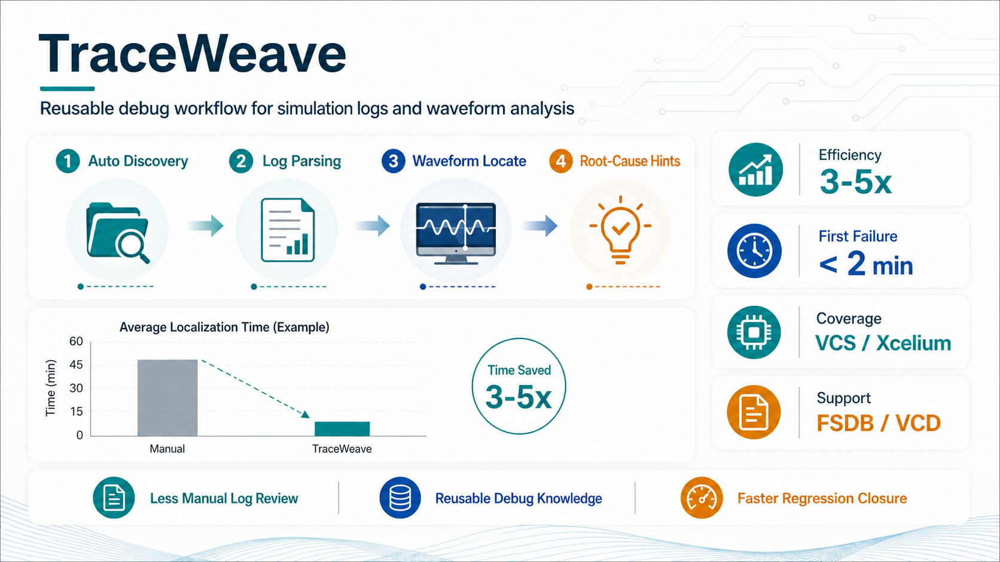

# 🐙 TraceWeave

<p align="right">
  <strong>English</strong> · <a href="README.zh.md">简体中文</a>
</p>

<p align="center">
  
</p>

<p align="center">
  <strong>MCP server for simulation-failure debug through log parsing and waveform analysis</strong>
</p>

<p align="center">
  <a href="https://github.com/gokeshenzhen/TraceWeave/actions/workflows/ci.yml"></a>
  <a href="LICENSE"></a>
  <a href="https://www.python.org/"></a>
  <a href="https://github.com/gokeshenzhen/TraceWeave/stargazers"></a>
</p>

<h2 align="center">Waveform + log root-cause MCP — stop debugging by hand, use TraceWeave.</h2>

What sets TraceWeave apart: when a Verdi license is available it engages KDB/NPI for accurate cross-hierarchy driver / load / connectivity analysis; without a license it still locates issues via the built-in Static backend, log parsing, and VCD/FSDB waveform reads. It supports driver backtracking, load/fanout lookup, value-at-time queries, cycle-aligned sampling, arbitrary signal-window queries, lightweight X/Z tracing, structural risk scanning, and failure-group diffing — and emits structured next-step debug recommendations for MCP clients.

<p align="center">
  
</p>

<p align="center"><sub>Workflow illustration; timing and speedup depend on project scale and waveform availability.</sub></p>

TraceWeave is a workflow-oriented debug server rather than a loose collection of parsers. It combines:

- An MCP server with session state, workflow gates, and recommended tool ordering
- Path discovery for compile logs, simulation logs, and waveform artifacts
- Compile-log-driven hierarchy building and source-aware driver correlation
- VCD and FSDB waveform backends with signal search
- Failure-centric recommendations, structural risk scanning, and X/Z propagation tracing
- Structured output schemas designed for MCP clients

[Architecture](docs/architecture.md) · [Installation](#installation) · [Client Setup](#client-setup) · [Standard MCP Workflow](#standard-mcp-workflow) · [Tool Quick Reference](#tool-quick-reference) · [Testing](#testing) · [WeChat](#wechat)

## When TraceWeave helps most

TraceWeave is not a universal speedup, and it is honest about that. In blind
benchmarking against a capable LLM that only reads source and text logs:

- **When the RTL is readable and the bug is a source-visible logic error**, an
  LLM reading the source is already fast. Here TraceWeave mainly *confirms* the
  hypothesis from the waveform — and `scan_structural_risks` can statically pin
  the offending line. Useful, but not where the moat is.
- **TraceWeave becomes the decisive — sometimes the only — way to localize when
  the answer is not in readable source:**
  - the design is **encrypted/protected IP** or too large to eyeball, so the bug
    cannot be read or grep'd; or
  - the failure is a **timing / handshake / X / connectivity bug with no static
    signature** and an **opaque symptom** (timeout, stall, divergence — no value
    pattern in the log).

  In those cases the clock-sampled waveform facts — cycle-aligned sampling,
  `inspect_handshake`, `suggest_protocol_bundles`, `sweep_handshakes`,
  `reconstruct_transactions`, `verify_window`, `diff_first_divergence`,
  `period`, `trace_x_source`, structural scanning — localize the failing stage
  and time directly, where
  reading source or grepping cannot reach. Reading the source is a strong
  baseline; TraceWeave earns its keep on **opaque symptoms and unreadable or
  large designs.**

## Architecture

- Architecture map: `docs/architecture.md`
- New-session bootstrap: read `AGENTS.md` first, then follow its first-read file list
- Fast path for code understanding:
  - `server.py`
  - `config.py`
  - `src/analyzer.py`
  - `src/log_parser.py`
  - `src/fsdb_parser.py`

## Repository Layout

```text
TraceWeave/
├── config.py                 # Environment-sensitive constants and discovery rules
├── server.py                 # MCP entry point, session state, and workflow gating
├── custom_patterns.yaml      # User-extensible log patterns
├── fsdb_wrapper.cpp          # Native FSDB wrapper source
├── build_wrapper.sh          # Builds libfsdb_wrapper.so
├── scripts/                  # setup_fsdb.sh / verify_fsdb.sh
├── tests/                    # Unit and integration tests
└── src/
    ├── path_discovery.py
    ├── compile_log_parser.py
    ├── tb_hierarchy_builder.py
    ├── vcd_parser.py
    ├── fsdb_parser.py
    ├── fsdb_signal_index.py
    ├── waveform_batch.py         # FSDB+VCD time-window batch reader
    ├── log_parser.py
    ├── analyzer.py
    ├── signal_driver.py
    ├── signal_load.py            # Load/fanout finder, Static + NPI
    ├── connectivity_backend.py   # ConnectivityBackend protocol + select_backend
    ├── verdi_backend.py          # KDB / license probe + kdb_hint generator
    ├── verdi_npi_backend.py      # NPI-backed driver/load resolution
    ├── kdb_builder.py            # Auto-build Verdi KDB (vericom + elabcom) for Xcelium flows
    ├── structural_scanner.py
    ├── x_trace.py
    ├── cycle_query.py
    ├── schemas.py
    ├── problem_hints.py
    ├── hierarchy_handles.py      # HandleStore + content-addressed handle for build_tb_hierarchy
    ├── handle_tools.py           # get_tb_subtree / lookup_tb_files / find_tb_instance / ...
    ├── cursor_store.py           # Named, process-scoped time anchors (cursor_set/list/delete)
    ├── timespec.py               # Resolve @cursor / unit literals (12.34ns) to ps on time inputs
    ├── verify_condition.py       # diff_first_divergence, period, inspect_handshake
    ├── window_verify.py          # verify_window: temporal predicate over a clock window
    ├── handshake_suggest.py      # suggest_handshakes / suggest_protocol_bundles
    ├── handshake_sweep.py        # sweep_handshakes: whole-design handshake anomaly sweep
    ├── txn_reconstruct.py        # reconstruct_transactions: id-correlated transaction layer
    ├── cancellation.py           # Cooperative cancellation for worker-thread waveform scans
    └── usage_telemetry.py        # Local-only per-call usage telemetry (opt-out)
```

## Installation

TraceWeave requires Python `3.11+`.

```bash
pip install mcp pyyaml --user
```

For FSDB support, one of these runtime sources must be available:

- Repo-local runtime: `third_party/verdi_runtime/linux64/libnsys.so` and `libnffr.so`
- External Verdi installation exposed via `VERDI_HOME/share/FsdbReader/linux64`

If neither is available, TraceWeave still works, but FSDB parsing is disabled and the workflow should prefer `.vcd` waveforms.

Enable FSDB support (links the Verdi runtime into the repo and builds
`libfsdb_wrapper.so` in one step):

```bash
# Example only — replace with your site's Verdi install path
export VERDI_HOME=/path/to/verdi
bash scripts/setup_fsdb.sh
```

> **After `git pull`**: `libfsdb_wrapper.so` is built locally, not tracked in
> git. If a pulled update changed `fsdb_wrapper.cpp`, the first FSDB query
> fails with a *"libfsdb_wrapper.so is outdated"* error — rebuild with
> `bash build_wrapper.sh` and reconnect the MCP server. This is deliberately
> fail-loud: an outdated wrapper could silently return misaligned timestamps.

Verify the runtime and wrapper load correctly. This script does **not**
require `$VERDI_HOME` and is safe to run on any host that already has the
repo-local artefacts:

```bash
bash scripts/verify_fsdb.sh
```

## Client Setup

### Generic MCP Client

Any MCP client that supports stdio transport can connect to this server. The minimum configuration is:

- command: `python3.11`
- args: `["<TRACEWEAVE_HOME>/server.py"]`
- env: provide either repo-local `third_party/verdi_runtime/linux64` or `VERDI_HOME` if FSDB support is required

If the client supports server instructions, it can follow the built-in workflow directly. Otherwise, use the workflow below.

### Claude Code

Neither Claude Code nor Codex inherits your interactive shell env into the spawned MCP stdio server, so list every variable the server needs — tool roots plus the `dlopen` chain (`LD_LIBRARY_PATH` is the one most often missed; without it NPI silently falls back to Static and `trace_signal_path` returns `found: false`).

Add this to `~/.claude.json`:

```json
{
  "mcpServers": {
    "TraceWeave": {
      "command": "python3.11",
      "args": ["<TRACEWEAVE_HOME>/server.py"],
      "env": {
        "VERDI_HOME": "<verdi-install>",
        "NOVAS_HOME": "<verdi-install>",
        "VCS_HOME": "<vcs-install>",
        "XLM_ROOT": "<xcelium-install>",
        "CDS_INST_DIR": "<xcelium-install>",
        "SNPSLMD_LICENSE_FILE": "xxxx@s-license.example.com",
        "LM_LICENSE_FILE": "xxxx@s-license-server.example.com",
        "CDS_LICENSE_FILE": "xxxx@c-license.example.com",
        "LD_LIBRARY_PATH": "<library-path>",
        "PATH": "<path>"
      }
    }
  }
}
```

Verify the connection:

```bash
claude mcp list
# Should show TraceWeave (connected)
```

### Codex

Same idea as Claude Code — list everything explicitly. Add to `~/.codex/config.toml`:

```toml
[mcp_servers.TraceWeave]
command = "python3.11"
args = ["<TRACEWEAVE_HOME>/server.py"]
cwd = "<TRACEWEAVE_HOME>"
env = {
  VERDI_HOME      = "<verdi-install>",
  NOVAS_HOME      = "<verdi-install>",
  VCS_HOME        = "<vcs-install>",
  XLM_ROOT        = "<xcelium-install>",
  CDS_INST_DIR    = "<xcelium-install>",
  SNPSLMD_LICENSE_FILE = "xxxx@s-license.example.com",
  LM_LICENSE_FILE     = "xxxx@s-license-server.example.com",
  CDS_LICENSE_FILE    = "xxxx@c-license.example.com",
  LD_LIBRARY_PATH = "<library-path>",
  PATH            = "<path>"
}
```

Verify the connection:

```bash
codex mcp list
# Should show TraceWeave with Status: enabled
```

### Functional Verification

After connecting either client, run a quick end-to-end smoke test:

1. Start `codex` or `claude` inside a project directory that contains a sim log and waveform files.
2. Submit a direct waveform-debug request, for example: "Call the TraceWeave MCP. Start with `get_sim_paths` to list the logs and waves for this case."
3. Confirm that the execution log shows actual MCP tool calls such as `get_sim_paths`, `parse_sim_log`, and `search_signals` — not just shell commands reading files manually.

## Standard MCP Workflow

This is the default workflow for simulation-log and waveform debug:

1. Call `get_sim_paths(verif_root, case_name?)`. For non-standard layouts you may also pass explicit `sim_log` / `wave_file` / `compile_log` paths; any field you supply is used as-is and the omitted ones are still auto-discovered (a `sim_log` path also anchors discovery of the matching waveform and compile/elab logs). An explicit path may be absolute or relative — a relative path is resolved against `verif_root` and each of its ancestors (so a path relative to the repo root also works), and if still not found it is recovered by basename.
2. Choose the `phase == "elaborate"` compile log.
3. Run `build_tb_hierarchy` and `scan_structural_risks` in parallel on that same compile log.
4. If a sim log is present, call `parse_sim_log`; then, on a failing run with a waveform, call `sweep_handshakes` for a one-call whole-design protocol-health scan (a default-flow step, like `scan_structural_risks` at the runtime layer).
5. Use `recommend_failure_debug_next_steps` or `analyze_failure_event`.
6. Use `search_signals` and `analyze_failures` when you need waveform snapshots for explicit signals.
7. Use `explain_signal_driver`, `trace_x_source`, or `get_signals_by_cycle` for deeper investigation.
8. Use `get_diagnostic_snapshot` at any time to inspect reusable cached session state.

Important workflow rules:

- `scan_structural_risks` is part of the default workflow and should not be skipped unless the user explicitly asks to skip it.
- Use the same `compile_log` for both `build_tb_hierarchy` and `scan_structural_risks`.
- Prefer `failure_events[].time_ps` from `parse_sim_log` as the waveform time anchor.
- If `fsdb_runtime.enabled == false`, prefer `.vcd` over `.fsdb`.

## Tool Quick Reference

### Session Overview

- `get_diagnostic_snapshot`: Read-only summary of cached session data and suggested next calls; mirrors `parse_sim_log`'s `protocol_symptom_hint` so a scoreboard failure surfaces the protocol-health pointer at session start

### Paths and Hierarchy

- `get_sim_paths`: Discover compile logs, sim logs, waveforms, simulator, and cases. Optional explicit `sim_log` / `wave_file` / `compile_log` overrides win over auto-discovery; omitted fields are still discovered (anchored at the `sim_log`/`wave_file` directory)
- `build_tb_hierarchy`: Build testbench hierarchy server-side; return a slim payload (project, stats, depth-2 tree skeleton, interfaces, ambiguous_basenames, `hierarchy_handle`). Full data is reachable via the handle tools below.
- `scan_structural_risks`: Scan compiled RTL/TB sources for structural risk patterns

### Hierarchy Handle Tools

All take the `hierarchy_handle` returned by `build_tb_hierarchy`. On a stale or unknown handle they return `{"error": "handle_expired"}`; re-run `build_tb_hierarchy` to refresh.

- `get_tb_subtree(handle, root="", depth=1, max_nodes=500)`: Slice the component_tree starting at a dotted instance path.
- `lookup_tb_files(handle, ...)`: Query the compiled file set by objective scan facts (`basename`, `name_contains`, `path_contains`, `has_module`, `contains_uvm`, `file_type`). At least one filter is required. Use `basename=...` to disambiguate multi-version files reported in `ambiguous_basenames`.
- `find_tb_instance(handle, path=... | module=...)`: Locate an instance by exact path or all instances of a module.
- `get_tb_file_detail(handle, path)`: Return symbols defined in a single compiled file. Unknown paths return `file_not_in_compile_set` with basename-similar `did_you_mean` suggestions — verify file membership before any RTL read.
- `get_tb_class_hierarchy(handle, root_class?, depth=-1)`: UVM/SV class inheritance tree built from compile-set scans.
- `dump_tb_section(handle, section)`: Escape hatch for the full raw `compile_result`, `include_tree`, `filelist_tree`, `interfaces`, `files_full`, `component_tree_full`, or `class_hierarchy_full`. Prefer the targeted tools above.

### Log Analysis

- `parse_sim_log`: Parse and normalize runtime failures into grouped summaries and `failure_events`; also returns `log_snapshot_id` so same-path reruns can be compared after the simulator overwrites the log. On a scoreboard/compare-style failure it sets `protocol_symptom_hint`, a boundary-safe pointer reminding you to check bus-protocol health (run `sweep_handshakes` once for all interfaces) before reading RTL line-by-line — it never asserts a protocol type or a specific signal.
- `diff_sim_failure_results`: Compare two simulation runs by paths or by `base_snapshot_id` / `new_snapshot_id`. If only `new_log_path` is supplied after an earlier `parse_sim_log` of the same path, TraceWeave uses the previous parsed snapshot as the baseline.
- `get_error_context`: Extract raw log context around a specific line

### Waveform Analysis

- `search_signals`: Resolve full hierarchical signal paths. `keyword` accepts a single string or a **list of keywords** (max 16) — pass a list to batch several lookups in one call (one result entry per keyword, in input order) instead of issuing consecutive single-keyword searches. Each result also carries `direction` (`input`/`output`/`inout`/`implicit`/`null`) and `var_type` (`wire`/`reg`/`integer`/`real`/`parameter`/…), so clients can filter ports/nets/variables in a chosen scope without a separate tool. **FSDB** populates both fields; **VCD** populates only `var_type` and returns `direction: null` (the VCD format does not encode port direction)
- `get_signal_at_time`: Query a signal value at a specific timestamp
- `get_signal_transitions`: Retrieve transitions for a signal over time. Returns at most `max_transitions` entries (default 1000, earliest in range kept); a clipped result sets `truncated: true` + a `hint`. When bounded native FSDB output is also truncated, `transition_count_is_lower_bound=true`; narrow the time range for complete data. Otherwise `transition_count` reports the total found, and the explicit return cap can be raised for bulk extraction
- `get_signals_around_time`: Retrieve context around a failure timestamp. Flags a `value_at_center` that is a **sub-cycle transient** (a combinational glitch at the clock edge that settles back within the same cycle — e.g. an interconnect mux re-settling to idle for ~1ns) via `transient_note` + per-signal `center_transient`/`center_settles_to`, so an edge-sampled glitch is not misread as the settled protocol value. `return_mode="values_only"` keeps the atomic multi-signal sample but strips the transition lists (each signal returns `value_at_center` + `window_transition_count` + any transient annotation) — the compact shape for comparing one time point across several traces. `extra_transitions=0` is honored strictly: zero pre-window history.
- `get_signals_by_cycle`: Sample signals cycle-by-cycle on a clock edge
- `get_waveform_summary`: Return waveform metadata. Includes a time-scale self-check: `scale_unit` (the scale read from the waveform header, e.g. `100fs`/`1ps`/`1ns`; `unknown` when unreadable) and `scale_fs_per_tick` — all timestamps in tool output are real picoseconds converted with this factor, never raw file ticks. When the scale is unreadable the summary carries a `scale_warning` and every time-based query on that waveform is refused instead of silently assuming a 1ps scale

### Cursors and Verification Primitives

Time inputs on `get_signal_at_time`, `get_signal_transitions`, `get_signals_around_time`, `trace_x_source`, and `diff_first_divergence` accept a **TimeSpec**: a raw integer (ps), a cursor reference `@<name>`, or a unit literal such as `12.34ns` / `5us`.

- `cursor_set(name, time_ps, note?)` / `cursor_list()` / `cursor_delete(name)`: Named, process-scoped time anchors. Tools that locate an instant (e.g. `diff_first_divergence`, `period`) auto-register a cursor you can later reference as `@<name>` instead of copying ps timestamps across calls. Cursors are not persisted — server restart drops them.
- `diff_first_divergence(wave_path_a, signal_a, wave_path_b, signal_b, ...)`: First time two waveform signals hold unequal values — across two waveforms (e.g. passing vs failing run) or within one (two signals that should match, e.g. lockstep / shadow registers). Auto-registers a cursor at the divergence. Requires both sides to be dumped waveform signals (it does not compare against a software reference model).
- `period(wave_path, signal, edge?, ...)`: Dominant edge-to-edge period of a signal and the first beat that deviates from it (off-beat), auto-registered as a cursor. For "this signal should be periodic — where did the cadence first break?" (clocks, strobes, fixed-rate valids).
- `suggest_handshakes(wave_path, scope?, ...)`: Scans the waveform and proposes ready-to-use `inspect_handshake` bundles — pairs `*valid`/`*ready` by scope and stem, finds the clock, and groups the channel payload buses. Run it first so you don't hand-assemble `{clock, valid, ready, payload}`. Covers AXI/generic valid-ready and req/ack. When it finds nothing, a lightweight name probe (`htrans`→AHB, `psel`+`penable`→APB) upgrades the empty-result hint into a copy-paste-ready `suggest_protocol_bundles` call.
- `suggest_protocol_bundles(wave_path, protocol=ahb|apb, scope?, ...)`: Scans for protocol-specific bundles where there is no literal `valid`. AHB candidates return ready-to-use `inspect_handshake` args with `valid_htrans`, `ready`, and payload; APB candidates return `psel`/`penable`/`pready` facts and loudly report that `inspect_handshake` still needs a derived valid signal for `psel && penable`. For AHB candidates the result also returns a `next_step` field — a copy-paste-ready `inspect_handshake(...)` call per interface — because discovery only locates the bundle; the analysis is the `inspect_handshake` run. Direction tags are mechanical discovery facts only (`initiator_side` / `responder_side` / `unknown`), with unknown/conflicting markers reported rather than guessed.
- `inspect_handshake(wave_path, clock, valid, ready, payload?, ...)`: Cycle-by-cycle classification of a clocked valid/ready handshake — stall runs (valid high, ready low), the longest/over-threshold stalls, backpressure imbalance (ready high, valid low), and, when `payload` signals are given, payload-hold violations (a payload that changes while the transfer is still stalled). It also flags **premature valid deassertion** (`check_valid_hold`, default on): a stalled beat whose valid/htrans goes inactive the next edge — before ready/HREADY arrived — is the master dropping the transfer instead of waiting (the AHB master-not-waiting-for-HREADY bug). This needs no `payload` and catches what payload-hold structurally cannot: a 1-cycle stall (`max_stall_cycles==1`) never lets payload change, and htrans (the derived valid) is not a payload signal. Protocol-agnostic: AXI `*valid`/`*ready`, generic valid-ready streams, or credit interfaces. For AHB there is no literal valid — pass `valid_htrans=<htrans path>` (and `htrans_rule`: `active`=NONSEQ/SEQ, or `non_idle`) and a derived valid is computed (with `payload`=haddr/hwrite/hsize which must hold while hready is low; HWDATA/HRDATA are excluded as data-phase, so the hold check cannot false-positive on the address/data phase offset). For an AHB interface a third check, **x_while_valid**, flags a control field that is x/z while the derived valid is asserted — an active transfer carrying an unknown address/control field; it stays off for a literal-`valid` interface whose payload may be legally-x data lanes (a false positive). A separate **write data-phase hold** check (pass `hwrite` + `write_data`=HWDATA) verifies HWDATA stays stable through a write data-phase wait state (HREADY low) — a `write_data_hold_violation`; this is the data-phase window, one cycle behind the address-phase valid, that the htrans-keyed payload-hold cannot see (and why HWDATA is excluded from `payload`). It is sound only on the producer (initiator/master) interface — a responder interface's HWDATA is an interconnect-mux output that glitches at the clock edge — so `suggest_protocol_bundles` attaches `hwrite`/`write_data` only to initiator-side bundles. On AHB the result also carries a `protocol_semantics` receipt naming which metrics are faithful vs suppressed (valid-hold faithful; `ready_without_valid` is idle-bus, not a violation; payload-hold address-phase only), and the premature-deassertion finding carries `accepted_before_deassert=False` (the dropped beat was never accepted) — so a true positive cannot be waved away as AHB pipeline overlap. Returns `coverage` facts for checks it actually ran (`stall_checked`, `backpressure_checked`, `payload_hold_checked`/partial, `valid_hold_checked`, `x_while_valid_checked`), without assigning protocol side. Auto-registers a cursor at the first problem (x-while-valid > hold violation > premature deassertion > long stall > longest stall). On a finding it sets `violating_signal` (the held signal for a payload-hold, the x'd control field for an x-while-valid, the valid/htrans for a premature deassertion; `null` for a plain stall) and a `next_actions` link to `explain_signal_driver`. For the **one-sided** violations (x-while-valid, payload-hold, premature deassertion) it also returns a structured `attribution` block — `violating_side=valid_driver`, `exonerated_side=ready_driver` — because both are breaches of the valid-driver's obligation (payload travels with valid; only the producer can mutate payload mid-stall or drop valid before acceptance), so the responder/ready side **cannot** cause them: don't start in the slave driver/monitor. This is protocol role, not trace-ownership: the valid-driver is the channel producer (master on AXI AW/AR/W, slave on R/B; AHB htrans is always master) — `explain_signal_driver` on `valid` lands on the actual instance. A plain stall is genuinely two-sided, so `attribution` stays empty and the link targets `ready`. Surfaces protocol-timing facts that leave no value pattern in scoreboard logs.
- `sweep_handshakes(wave_path, scope?, ...)`: Whole-design handshake **anomaly sweep** — discovers every valid/ready interface **and every AHB interface** (htrans-derived valid) and inspects each over the window in one call, returning a comparative fact table (per-interface `kind`=`valid_ready`/`ahb`, stalls, deadlock signature, x-while-valid, payload-hold, write-data-hold, premature valid deassertion, backpressure) ordered by a transparent mechanical key (on an `ahb` row `ready_without_valid` is suppressed from `flags` and the sort — it is idle-bus, not backpressure). This is the one-call protocol-health check the scoreboard-failure hint steers toward (APB excluded — needs a derived valid; clocking-block `*_cb` mirror scopes are dropped — no own clock, redundant with the parent interface). For opaque global symptoms (timeout/hang) when you don't yet know which of many interfaces misbehaves; it collapses N `suggest_handshakes`+`inspect_handshake` round-trips into one. Returns facts, not a root-cause verdict — re-rank as the symptom warrants. On a backpressured pipeline the worst-stall ordering surfaces the propagation front, while the root is the stall→starvation boundary. The result includes `coverage_status` (`complete`/`truncated`/`zero_coverage`/`degraded`) plus `coverage_warnings`; `flagged_count=0` is only meaningful when coverage is complete. In particular, a scoped sweep with `zero_coverage` checked no interfaces and is not a protocol pass; retry unscoped or with a parent/interface scope. Sets `truncated=true` (loudly) when discovery exceeds `max_interfaces` (default 64).
- `verify_window(wave_path, clock, mode, predicate | antecedent+consequent, ...)`: Evaluate a temporal predicate over a clock window and return a precise `holds` verdict plus a concrete witness/counterexample (cycle + sampled values). Templates, not a DSL: a *term* is `{signal, op, value}` (`op`: eq/ne/gt/ge/lt/le/is_x/is_known); a *predicate* is a list of terms (implicit AND); `mode` is `always` / `never` / `eventually` / `implication` (A ⊦→ B within N cycles) / `sequence` (per-accepted-beat increment of one signal — address-stride checks; `predicate` is the accepted-beat gate, `delta`=`{signal,value,op?,modulo?,restart_when?}`, where `modulo` absorbs WRAP wrap-around and `restart_when` re-seeds at burst starts, both supplied by you so the tool stays burst-decode-free). `implication` takes an `overlap` flag: default `true` (`|->`, response window includes A's own cycle) or `false` (`|=>`, window starts the NEXT cycle) — use `overlap=false` for a **stability/hold** property ("B must STILL hold next cycle", e.g. AHB `HTRANS`/valid held through a wait state: `(htrans==2 && hready==0) |=> htrans==2`), where A already implies B on its own cycle. With `overlap=true` such a property is a **vacuous pass** (B already true on A's cycle, the window never matters) — the result is flagged `vacuous=true` with a loud `VACUOUS PASS` warning so a `holds=true` is not misread as exclusion evidence; re-run with `overlap=false`. x/z cycles are reported as `unknown` (never silently passed) and an implication whose response window runs past end-of-trace is `inconclusive` (never silently failed). On a `sequence` violation it sets `violating_signal` + a `next_actions` link to `explain_signal_driver` (bus facts do not self-attribute master/slave). Use to prove or disprove an RTL inference in one call.
- `reconstruct_transactions(wave_path, clock, req_valid, req_ready, cmp_valid, cmp_ready, ...)`: Reconstruct id-correlated request/response transactions from two handshake channels — match accepted request beats to completion beats by an `id` field and return per-transaction latency plus aggregate facts (outstanding curve incl. per-id peak, ordering, unmatched = hang signature). One generic core, not a tool per protocol: AXI read = AR→R (`req_id`=arid, `cmp_id`=rid, `cmp_last`=rlast); AXI write = AW→B plus an optional unindexed W-data channel (`data_valid`/`data_ready`/`data_last` + `data_fields`). `req_id`/`cmp_id` are optional — omit both for an unindexed in-order stream (AXI-Lite, APB), which pairs in FIFO order. An optional `reset` clears in-flight state so a transaction straddling reset is not a phantom hang. An optional `req_len` (AxLEN) checks each txn's `beat_count` against `req_len+1` — a mismatch (early/late LAST, dropped/extra beat) is surfaced per-txn (`expected_beats`, `beat_count_mismatch`) and as `beat_count_mismatch_count` (x/z len → not checked; no `req_len` → count 0 = not checked, not a clean verdict). `latency` is a distribution, not an "outlier" verdict; out-of-order completion across ids is supported.

FSDB coverage note: native transition output is bounded. If an inspected clock
or signal returns only a prefix, the affected handshake row sets
`transition_data_truncated`, the sweep increments `transition_truncated_count`,
and `coverage_status` is not `complete`; zero findings then apply only to the
returned prefix. Narrow the time window for a complete targeted check.

### Deep-Dive Analysis

- `analyze_failures`: Focus on one grouped failure and return log plus waveform context
- `analyze_failure_event`: Rank likely instances, source files, and signals for a specific `failure_event`
- `recommend_failure_debug_next_steps`: Return the default next debug target
- `explain_signal_driver`: Trace a waveform signal back to likely RTL driver logic
- `find_signal_loads`: List the consumers (fanout) of a signal — module-input ports, RHS uses, always-block sensitivity
- `trace_signal_path`: Find a connectivity path between two signals in the elaborated netlist (NPI-only). Returns connectivity, NOT temporal driver direction — use `explain_signal_driver` for driver semantics. Without a Verdi KDB this tool returns `unsupported_reason="static_backend_no_path_api"` because source-regex cannot honestly reproduce `sig_to_sig_conn_list`; fall back to `explain_signal_driver` + `find_signal_loads` in that case.
- `trace_x_source`: Trace X/Z propagation upstream
- `build_kdb`: Auto-build a Verdi KDB from the parsed compile log (vericom + elabcom). Use when the simulator is Xcelium (xrun) and the NPI backend reports no KDB. Output is cached under `TRACEWEAVE_CACHE_DIR` (default `~/.cache/traceweave/kdb/<hash>/`); cache hits skip re-running Verdi. A runnable `build.sh` is written next to the KDB for inspection or manual reproduction. Requires `VERDI_HOME` with `bin/vericom` and `bin/elabcom`.

`explain_signal_driver`, `find_signal_loads`, and `trace_signal_path` automatically engage a Verdi NPI backend when a KDB is detected. The first two transparently fall back to a Static source-regex backend when NPI is unavailable; `trace_signal_path` is NPI-only and returns a structured `unsupported_reason` instead of an approximation, since `sig_to_sig_conn_list` has no honest static equivalent. NPI is the deep / accurate path: it walks the elaborated netlist with `fan_in_reg_list` / `sig_to_sig_conn_list`, so it can cross instance port boundaries, interface positional bindings, and assign chains that Static cannot follow. When a KDB is present, `build_tb_hierarchy` also overlays each component-tree node's `source_file` / `source_line` with NPI's elaborated `file:line`; affected hops in `find_driver` / `find_loads` results carry a `source_info_origin: "npi"` tag so consumers can tell NPI-annotated entries from compile-log-derived ones. The result envelope carries a `backend_status` block with the active backend, KDB flow, and a per-simulator `kdb_hint`. NPI is deep but not infallible: when the *only* driver it can report for a net is also a LOAD of that net (an interface-slice alias, or a register that reads the net), there is no RTL driver and the real driver is testbench/behavioral — a UVM driver writing through a virtual interface + clocking block, which RTL register fan-in cannot see. `explain_signal_driver` detects this contradiction with a driver-vs-loads cross-check and returns `driver_status="testbench_driven"` (with a `cross_check.conflict` receipt) instead of naming the load as an "exact" driver — so an AHB master's HTRANS/HADDR points you at the TB driver/BFM, not at a DUT interconnect register that merely reads the bus.

For VCS flows the cheapest way to get a KDB is to recompile with `-kdb=only` — the hint surfaces the exact command. For Xcelium flows there is no native KDB; `get_diagnostic_snapshot` will list `build_kdb` in `missing_steps` so the LLM agent can produce one on demand. Set `TRACEWEAVE_AUTO_KDB=0` to opt out of the auto-build suggestion.

### Usage telemetry

When enabled, TraceWeave appends one JSONL line per tool call to `$TRACEWEAVE_CACHE_DIR/telemetry/usage.jsonl` (default `~/.cache/traceweave/telemetry/`) — tool name, argument *keys* and a few scalar flags (never argument values or paths), result size, latency, a session id anchored to each `get_sim_paths` case, and on failed calls a classification `error_code` (a code or exception class name, never the message). It is **local-only** (nothing is sent anywhere) and exists to quantify which tools actually get used. Default-off; set `TRACEWEAVE_TELEMETRY=1` to enable it. Summarize with `python scripts/telemetry_report.py`.

## Testing

Run the full test suite from the repo root:

```bash
python3.11 -m pytest
```

Run a single file:

```bash
python3.11 -m pytest tests/test_server.py
```

Run a single test:

```bash
python3.11 -m pytest tests/test_server.py -k diagnostic_snapshot
```

Recommended change flow:

1. Make the code change.
2. Run the relevant tests first.
3. Run the full suite if the change affects shared behavior.
4. Restart the MCP client so it reconnects to the updated server.

## WeChat

Follow the WeChat public account:

<p align="center">
  
</p>
