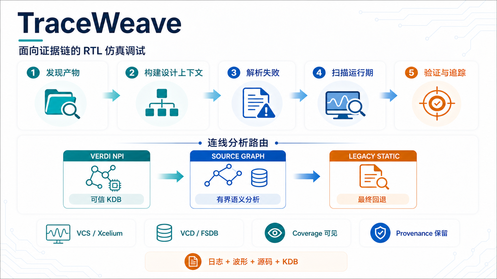

# 🐙 TraceWeave

<!-- mcp-name: io.github.gokeshenzhen/traceweave -->

<p align="right">
  <a href="README.md">English</a> · <strong>简体中文</strong>
</p>

<p align="center">
  
</p>

<p align="center">
  <strong>证据链驱动的仿真调试 MCP 服务器</strong>
</p>

<p align="center">
  <a href="https://github.com/gokeshenzhen/TraceWeave/actions/workflows/ci.yml"></a>
  <a href="https://pypi.org/project/traceweave-mcp/"></a>
  <a href="LICENSE"></a>
  <a href="https://www.python.org/"></a>
  <a href="https://github.com/gokeshenzhen/TraceWeave/stargazers"></a>
</p>

TraceWeave 是面向 RTL / SoC 调试的 MCP 服务器。它把编译记录、仿真日志、VCD/FSDB 波形和 RTL 源码接入 AI 助手，帮助你从“仿真失败了”逐步定位到异常时刻、相关信号和驱动逻辑。

支持 Claude Code、Codex、Copilot 等 MCP 客户端。你用自然语言描述问题，助手通过工具查证、追踪和验证，返回可以复查的调试证据。

[适用场景](#适用场景) · [安装](#安装) · [客户端配置](#客户端配置) · [开始调试](#开始调试) · [工具速查](#工具速查) · [常见问题](#常见问题) · [文档与反馈](#文档与反馈)

<p align="center">
  
</p>

## 适用场景

| 遇到的问题 | TraceWeave 能帮助你做什么 |
|---|---|
| 仿真超时、卡死，不知道从哪里查起 | 汇总失败日志，扫描多接口握手行为，缩小异常接口和时间窗口 |
| Scoreboard mismatch、两次运行结果不同 | 对比失败记录与波形，定位已观测到的差异，并追踪两侧数据和控制来源 |
| 信号出现 X/Z | 沿驱动追踪传播路径，回看历史波形，检查寄存器是否曾采入并保持未知值 |
| 打包总线难读、TL-UL 请求迟迟没有响应 | 按字段查看地址、数据和控制信号，检查请求与响应的握手、延迟和完成情况 |
| 怀疑 tie 值、悬空输入或 magic word 条件 | 静态扫描源码，提取常量连接、未连接输入和常量比较等线索，供进一步核查；无需运行仿真或提供波形 |
| SoC 层级深、模块和接口多 | 按需浏览层次、查找实例与源码，追踪信号的驱动、消费者和连通路径 |
| 想验证一个调试假设 | 按周期采样，检查时序条件、握手保持和事务完成情况，取得具体证据 |

支持 VCS / Xcelium 仿真日志及 VCD / FSDB 波形。已有 formal 导出波形同样可查询；当前支持自动发现 JasperGold 产物。

信号追踪（驱动、负载与连通路径查询）默认采用 **Verdi NPI → Source Graph → 基础静态分析（Legacy Static）** 三级路由：优先查询已展开的 KDB；NPI 不可用或无法提供可信结果时，尝试免商业 license 的 Source Graph，必要时再按支持范围回退到基础静态分析。

面向大型设计的能力与已验证的部分规模：

- **层次与源码按需浏览**：服务端建立并保留层次和文件索引，助手按实例、子树或文件获取局部结果，减少大型 SoC 的上下文开销。已用 **50,500 个逻辑实例**的合成设计验证层次构建与局部查询；初次构建仍需扫描编译记录和源码。
- **批量握手检查**：`sweep_handshakes` 自动发现 AHB / valid-ready 接口，检查停顿、数据/控制保持和 valid/HTRANS 提前撤销等行为。已有 **78,817 个总信号、2.59 ms 波形时长**的设计记录：发现 49 个候选接口，涉及 262 个时钟/协议信号，约 **4.65 分钟**检查了 35 个接口；另有 14 个跳过，属于部分覆盖。实际耗时和覆盖范围取决于波形、接口类型与资源限制。
- **GiB 级日志解析**：`parse_sim_log` 已通过 **1 GiB、2,097,152 行**合成日志验证，识别了分布在文件开头、中间和末尾的全部 4 条报错。

## 安装

需要 **Python 3.11+**。按你的工作环境选择安装方式：

| 安装方式 | 适用场景 |
|---|---|
| 仓库安装 | 在已有 Verdi 环境的仿真主机上使用 FSDB、Source Graph，以及可选的 NPI / LSF |
| PyPI 安装 | 分析日志、VCD，或使用无需商业 license 的 Source Graph |

### 仓库安装

```bash
git clone https://github.com/gokeshenzhen/TraceWeave.git
cd TraceWeave
export VERDI_HOME=/path/to/verdi
bash scripts/install.sh
```

安装器准备 Python 环境、Source Graph 和 FSDB 读取组件，并检查运行环境。它不会修改 shell 启动文件或 MCP 客户端配置；NPI 仍需站点提供相应的运行环境和 license。

已有安装可先执行只读检查：

```bash
bash scripts/install.sh --check
```

### PyPI 安装

```bash
python3.11 -m pip install "traceweave-mcp[source-graph]"
traceweave-mcp --doctor
```

如果只需要日志、VCD 和基础静态分析，可安装 `traceweave-mcp`，省略 `[source-graph]`。PyPI 包不包含 FSDB 读取组件；需要 FSDB 时请选择仓库安装。

## 客户端配置

仓库安装后，可生成带绝对路径的客户端配置模板：

| 客户端 | 生成配置模板 |
|---|---|
| Claude Code | `bash scripts/install.sh --print-config claude` |
| Codex | `bash scripts/install.sh --print-config codex` |
| Copilot | `bash scripts/install.sh --print-config copilot` |

命令只打印模板。将输出添加到对应客户端的 MCP 配置中，补充所需的站点 EDA 环境变量，然后重新连接服务器。完整示例见[客户端配置说明](docs/architecture.md#client-configuration-reference)。

其他支持 stdio 的 MCP 客户端也可使用以下连接参数：

| 安装方式 | `command` | `args` |
|---|---|---|
| 仓库安装 | `<仓库绝对路径>/.venv/bin/python` | `["<仓库绝对路径>/server.py"]` |
| PyPI 安装 | `traceweave-mcp`，或该命令的绝对路径 | `[]` |

### 仅执行节点可用的 NPI License

如果 Verdi/NPI license 只能在 LSF 执行节点使用，让 MCP 服务进程获得以下设置，将 `digital` 换成你的队列：

```bash
export TRACEWEAVE_NPI_EXECUTION=lsf
export TRACEWEAVE_NPI_LSF_QUEUE="digital"
```

客户端需要继承或显式传入这些变量；相关工程文件与 TraceWeave 安装、缓存目录须在提交节点和执行节点以相同绝对路径可见。完整的 bash / tcsh、客户端环境转发和验证方法见 [LSF 配置说明](docs/architecture.md#lsf-only-npi-licenses)。

## 开始调试

连接客户端后，可以直接这样提问，把路径换成你的工程目录：

> 请用 TraceWeave 分析 `/path/to/verif` 下 `my_case` 的仿真失败。先查看日志、设计结构和接口握手，再追踪可疑信号；结论请附上时间点、信号和源码依据。

也可以从一个具体问题开始：

> 比较这两份波形中 `tb.dut.result` 的差异，并追踪两侧产生差异的逻辑。

> 用 deep 模式扫描这份编译日志对应的设计，检查可疑的 tie 值、悬空输入和常量比较条件。

助手的默认调查流程是：

1. **找到本次运行的产物**：发现编译日志、仿真日志与波形。
2. **建立设计上下文**：使用同一份编译日志，并行构建层次与扫描结构风险。
3. **缩小问题范围**：解析失败；对于有波形的失败运行，扫描握手异常。
4. **追踪并验证**：查看相关信号、驱动和消费者，用时间窗或周期检查验证假设。
5. **对比修复结果**：比较下一次运行的失败记录和波形变化。

首次连接时，可先要求助手调用 `get_sim_paths`，确认客户端能够执行真实的 MCP 工具调用。完整流程见[调试工作流](docs/workflow.md)。

仓库安装可运行 `.venv/bin/python scripts/check_waveform_readback.py --work-dir /tmp/traceweave-readback-check`
做无需 EDA license 的读值自检。它通过 MCP 检查服务端工具列表和实际点／批量读值，
并输出供独立 AI 客户端会话执行的明确请求。服务端检查不会把客户端可见性或模型采用率
标记为已证实，详见[读值客户端自检](docs/architecture.md#readback-client-check)。

### 定位波形差异与 X/Z 来源

两次仿真结果不一致时，TraceWeave 可比较指定信号，找到时间窗口内最早能确认的差异，并沿两侧驱动追踪相关的数据、控制和 RTL 逻辑。

对于 X/Z，既可以查看异常时刻的传播路径，也可以回看历史，检查寄存器是否曾采入未知值，随后一直保持。即使当前输入已经正常，也能继续调查之前发生的异常：

> `tb.dut.q` 在 36 ns 时为 X，但输入已经正常。请回看 0～36 ns 的波形，检查此前的采样与保持情况，并追踪可疑来源。

结果会列出有证据支持的关系和仍需核查的环节。历史记录不足或遇到暂不支持的结构时，会说明停止原因，不把“首次看到异常”直接当成“真实首次产生异常”。

工具参数与详细支持范围见[波形差异分析](docs/architecture.md#divergence-evidence-and-backtrace)和 [X/Z 历史追踪](docs/architecture.md#bounded-x-history)。

### 计算 SV 表达式

现有波形工具支持显式 `{ "expr": "a[b] + c", ... }` 输入，按 SV 优先级、位宽、signed 和四态规则求值，每次观察都会重新采样下标。点、周期、变化窗口、条件、握手、事务、TL-UL 及 RTL 自动回溯共用计算核心，无需新增 MCP 工具。

使用精确 `bindings` 和显式 `types`，或选择 `typing: "wave_bits"`，将实际 dump 向量作为 unsigned 四态数据读取。固定数组使用有界元素映射；计算公式不会替换输出信号的实际记录值。详见[表达式输入、示例与限制](docs/expressions.md)。

### 按字段查看总线，检查 TL-UL 接口

当地址、数据和控制信息打包在同一条总线中时，TraceWeave 可依据与波形匹配的源码类型识别字段位置，让助手按字段查看变化，减少手工查位宽、算偏移的工作。无法自动识别时，也支持提供字段与位段的对应关系。

对于 TL-UL 接口，助手确认字段对应关系和时钟后，可检查指定时间范围内的握手停顿、请求与响应的对应关系、响应延迟，以及尚未完成的请求：

> 检查 `tb.dut` 的 TL-UL 接口在 10～20 μs 内是否有握手停顿或未完成的请求，并列出对应的时间和信号。

结果会说明实际检查的项目和缺失信息。窗口内尚未完成的请求不直接判为死锁，这些检查也不替代完整的 TL-UL 协议验证。

调试对话较长时，可以要求助手使用紧凑证据输出。重复的字段映射只展示一份，实际检查范围、缺失证据、时间边界和下一步仍会保留。已有客户端默认保持原有输出。示例及客户端接入方式见[紧凑证据输出](docs/architecture.md#compact-evidence-output)。

字段配置与详细支持范围见[总线字段与 TL-UL 使用说明](docs/architecture.md#packed-waveform-selections-and-tl-ul)。

### 自定义运行期报错格式

`parse_sim_log` 已内置标准 `UVM_ERROR` / `UVM_FATAL` 和 VCS / Xcelium 断言失败的解析，并提供通用 `ERROR` 匹配。对于项目自定义的 checker、scoreboard 或 `$display` 输出，可以在 [custom_patterns.yaml](custom_patterns.yaml) 中添加 Python 正则表达式，无需修改 Python 代码。日志不必包含 `UVM_ERROR`，甚至不必包含 `ERROR`。

如果日志使用同一个标签，后面的内容每次不同，只匹配标签就够了：

```text
MY_CHECK_FAIL @ 12.5 ns expected=0x12 actual=0x34
MY_CHECK_FAIL @ 20 ns timeout waiting for response
```

将默认的 `patterns: []` 替换为以下内容；如果已有规则，在原来的 `patterns` 列表中追加即可：

```yaml
patterns:
  - name: my_checker
    severity: ERROR
    regex: '^MY_CHECK_FAIL'
```

`^` 表示行首；标签之后可以是不同的内容，无需继续写正则。如果标签前面还有时间戳或其他前缀，改用 `regex: 'MY_CHECK_FAIL'` 即可在整行中查找标签。
- `name` 标识失败分组。`severity` 默认为 `ERROR`，也支持 `FATAL` 和 `WARNING`；匹配到的自定义 warning 也会计入运行期失败统计。`description` 是供维护者阅读的说明。
- `regex` 逐行匹配，建议用 YAML 单引号保留反斜杠。解析顺序是内置断言和 UVM 格式、自定义规则、通用 `ERROR` 匹配；自定义规则按列表顺序取第一条命中。已识别为编译或展开诊断的记录仍会被过滤。

上面的 `expected=0x12 actual=0x34` 已经能自动识别，用简单的标签规则就够了，无需命名捕获组。如果日志改用自己的字段名：

```text
MY_CHECK_FAIL @ 12.5 ns want=0x12 have=0x34
```

`regex: '^MY_CHECK_FAIL'` 仍能识别报错并保留整行消息。如果还希望把 `want` 和 `have` 的值单独提取为期望值和实际值，将上面规则中的 `regex` 替换为：

```yaml
regex: '^MY_CHECK_FAIL.*want=(?P<expected>\S+)\s+have=(?P<actual>\S+)'
```

仓库安装默认读取根目录的 `custom_patterns.yaml`。如果希望单独维护项目规则，或使用 PyPI 安装，将上面的 YAML 保存为自己的配置文件，并向 MCP 服务进程传入其绝对路径：

```bash
export TRACEWEAVE_CUSTOM_PATTERNS_FILE="/absolute/path/to/custom_patterns.yaml"
```

该设置会替换默认的自定义规则文件，内置格式继续生效。客户端需要继承或显式传入这个变量；更改变量后重启或重新连接服务，再解析日志。只修改已选中的 YAML 内容时，下次调用 `parse_sim_log` 就会重新加载。

## 工具速查

通常只需描述调试目标，由助手选择工具。下表按用途列出全部工具；具体参数由 MCP 工具定义提供。

<table>
  <thead>
    <tr>
      <th>类别</th>
      <th>工具名</th>
      <th>说明</th>
    </tr>
  </thead>
  <tbody>
    <tr>
      <td rowspan="3">会话与产物</td>
      <td><code>get_sim_paths</code></td>
      <td>发现仿真 case、编译日志、运行日志与波形</td>
    </tr>
    <tr>
      <td><code>get_formal_paths</code></td>
      <td>发现 formal 工程、日志及导出的波形，当前支持 JasperGold</td>
    </tr>
    <tr>
      <td><code>get_diagnostic_snapshot</code></td>
      <td>查看当前已收集的调试信息与待完成步骤</td>
    </tr>
    <tr>
      <td rowspan="7">层次与源码</td>
      <td><code>build_tb_hierarchy</code></td>
      <td>根据编译记录建立 RTL / testbench 层次视图</td>
    </tr>
    <tr>
      <td><code>get_tb_subtree</code></td>
      <td>查看指定实例的局部层次</td>
    </tr>
    <tr>
      <td><code>find_tb_instance</code></td>
      <td>按路径或模块名查找实例</td>
    </tr>
    <tr>
      <td><code>lookup_tb_files</code></td>
      <td>在实际编译文件集中查找源码</td>
    </tr>
    <tr>
      <td><code>get_tb_file_detail</code></td>
      <td>查看源码文件定义的模块、接口和类</td>
    </tr>
    <tr>
      <td><code>get_tb_class_hierarchy</code></td>
      <td>查看 UVM / SystemVerilog 类继承关系</td>
    </tr>
    <tr>
      <td><code>dump_tb_section</code></td>
      <td>获取指定部分的完整层次分析数据</td>
    </tr>
    <tr>
      <td rowspan="6">日志与失败</td>
      <td><code>parse_sim_log</code></td>
      <td>将运行失败归类，提取时间与错误摘要</td>
    </tr>
    <tr>
      <td><code>get_error_context</code></td>
      <td>查看错误附近的原始日志</td>
    </tr>
    <tr>
      <td><code>diff_sim_failure_results</code></td>
      <td>比较两次运行中新增、持续和已消失的失败</td>
    </tr>
    <tr>
      <td><code>analyze_failures</code></td>
      <td>汇总某组失败的日志与波形上下文</td>
    </tr>
    <tr>
      <td><code>analyze_failure_event</code></td>
      <td>从一个失败事件定位相关实例、信号与源码候选</td>
    </tr>
    <tr>
      <td><code>recommend_failure_debug_next_steps</code></td>
      <td>推荐下一步值得调查的目标与工具调用</td>
    </tr>
    <tr>
      <td>静态结构扫描</td>
      <td><code>scan_structural_risks</code></td>
      <td>静态扫描源码中的可疑结构；语义模式可检查 tie、悬空输入与常量比较</td>
    </tr>
    <tr>
      <td rowspan="4">信号追踪</td>
      <td><code>explain_signal_driver</code></td>
      <td>追踪信号的驱动来源与相关 RTL</td>
    </tr>
    <tr>
      <td><code>find_signal_loads</code></td>
      <td>查找信号的消费者与影响范围</td>
    </tr>
    <tr>
      <td><code>trace_signal_path</code></td>
      <td>查询两个信号之间的结构连通路径</td>
    </tr>
    <tr>
      <td><code>trace_x_source</code></td>
      <td>追踪 X/Z 的传播路径，检查历史上的寄存器采样与保持</td>
    </tr>
    <tr>
      <td rowspan="6">波形查询</td>
      <td><code>get_waveform_summary</code></td>
      <td>查看波形格式、时长、时间刻度和顶层模块</td>
    </tr>
    <tr>
      <td><code>search_signals</code></td>
      <td>根据名称查找完整信号路径</td>
    </tr>
    <tr>
      <td><code>get_signal_at_time</code></td>
      <td>读取指定时刻的信号值</td>
    </tr>
    <tr>
      <td><code>get_signal_transitions</code></td>
      <td>查看时间窗口内的信号跳变</td>
    </tr>
    <tr>
      <td><code>get_signals_around_time</code></td>
      <td>查看某时刻前后多个信号的变化</td>
    </tr>
    <tr>
      <td><code>get_signals_by_cycle</code></td>
      <td>按时钟沿逐周期采样多个信号</td>
    </tr>
    <tr>
      <td rowspan="4">差异与时序</td>
      <td><code>diff_first_divergence</code></td>
      <td>查找两个信号首次观测到的已知值差异</td>
    </tr>
    <tr>
      <td><code>trace_divergence</code></td>
      <td>验证波形差异，追踪两侧相关的数据、控制与历史状态</td>
    </tr>
    <tr>
      <td><code>period</code></td>
      <td>检查信号周期与节拍异常</td>
    </tr>
    <tr>
      <td><code>verify_window</code></td>
      <td>在波形窗口中验证时序条件，返回具体证据</td>
    </tr>
    <tr>
      <td rowspan="7">协议与事务</td>
      <td><code>suggest_handshakes</code></td>
      <td>发现 valid/ready 接口及检查所需的信号组合</td>
    </tr>
    <tr>
      <td><code>suggest_protocol_bundles</code></td>
      <td>发现 AHB / APB 接口信号组合</td>
    </tr>
    <tr>
      <td><code>sweep_handshakes</code></td>
      <td>扫描全设计中发现的 valid/ready 与 AHB 接口，汇总异常</td>
    </tr>
    <tr>
      <td><code>inspect_handshake</code></td>
      <td>检查指定接口的停顿、保持和握手异常</td>
    </tr>
    <tr>
      <td><code>reconstruct_transactions</code></td>
      <td>重建请求与响应事务，查看延迟、未完成请求和顺序</td>
    </tr>
    <tr>
      <td><code>resolve_packed_fields</code></td>
      <td>识别打包总线中的字段位置，便于单独查看地址、数据和控制信号</td>
    </tr>
    <tr>
      <td><code>inspect_tlul</code></td>
      <td>检查 TL-UL 请求与响应，查看握手停顿、响应延迟和未完成请求</td>
    </tr>
    <tr>
      <td rowspan="3">时间游标</td>
      <td><code>cursor_set</code></td>
      <td>为关键时刻命名，便于后续查询复用</td>
    </tr>
    <tr>
      <td><code>cursor_list</code></td>
      <td>列出当前会话的时间游标</td>
    </tr>
    <tr>
      <td><code>cursor_delete</code></td>
      <td>删除时间游标</td>
    </tr>
    <tr>
      <td>EDA 集成</td>
      <td><code>build_kdb</code></td>
      <td>从编译记录构建并缓存 Verdi KDB，供 NPI 查询使用</td>
    </tr>
  </tbody>
</table>

## 常见问题

**没有商业 license 也能用吗？**

日志分析、VCD 查询、静态结构扫描和 Source Graph 不需要商业 license。**直接查询已有波形中的信号值或跳变，不需要 NPI license**：VCD 使用内置解析器，FSDB 使用本地 Verdi FSDB Reader 库和 wrapper。Verdi NPI 信号追踪和 KDB 构建需要相应的 EDA 环境与 license。

**路径变量是否支持自恢复**

支持。在没有 source 过案例环境变量 setup 文件的终端上使用 CLI agent，或直接将其他终端已跑出的日志和波形交给 agent 分析时，TraceWeave 可从 VCS 编译日志和 filelist 中自动恢复能唯一确定的编译输入路径变量，用于层次分析、KDB 构建和 Source Graph 查询。

自恢复范围限于编译输入路径变量，对应源码与 include 文件需可访问。自恢复能力依赖的运行环境仍需预先提供：KDB 构建所需的 `VERDI_HOME`、工具安装及许可证配置，以及 Source Graph 所需的 Python / `pyslang` 依赖。

**信号追踪结果的准确性如何判断？**

NPI 基于与当前设计匹配的已展开 KDB；Source Graph 从源码构建语义连接图。在编译上下文完整、目标语义受支持，且查询满足**覆盖完整、解析精确、未截断**时，返回结果可作为**当前查询范围内的精确结构连接事实**，用于驱动、负载和连通路径分析。

**没有仿真结果，也能做静态结构扫描吗？**

可以。`scan_structural_risks` 对源码做静态分析，无需运行仿真，也不需要仿真运行日志或 VCD / FSDB 波形。当前接口需要提供编译/展开日志（`compile_log`），并保证对应的源码和 include 文件可访问，因此可以在编译/展开之后、仿真运行之前使用。

**静态结构扫描的 auto / deep 怎么选？**

默认 `auto` 执行源码文本规则扫描，并复用已有的适用语义结果；需要新做常量连接、未连接输入等语义检查时，告诉助手使用 `deep`。这是每次调用的 `analysis_mode` 参数，无需修改客户端配置。扫描发现的是待核查线索，正常 tie-off 或协议常量也可能被列出。

**扫描没有发现，就说明设计没有问题吗？**

结论取决于实际覆盖范围。缺少信号、超出资源预算或不支持的结构都会限制分析；零覆盖或部分覆盖时，零发现不代表设计无问题。工具会返回覆盖与截断信息，供助手判断是否需要缩小范围继续检查。

**能分析 formal 波形吗？**

可以查询已导出的 VCD / FSDB，并自动发现 JasperGold 产物。Property 结果、反例类型和可达性语义仍需由 formal 工具或用户提供。

独立导出的波形无需已识别的 formal 工程。发现波形但没有工程条目时，`get_formal_paths` 会提示现有点查询和批量读值入口；波形、信号和时刻由调用方选择。

**设计数据在哪里处理？**

文件解析与 EDA 查询在本地或配置的 LSF 执行节点完成；返回的调试证据会进入所用 AI 客户端的上下文。TraceWeave 的使用遥测默认关闭，启用后仅写入本地文件。

## 文档与反馈

| 想进一步了解 | 入口 |
|---|---|
| 标准调试步骤与工具配合 | [调试工作流](docs/workflow.md) |
| 如何用证据验证根因 | [调试准则](docs/debug-discipline.md) |
| 架构、后端能力与资源边界 | [架构文档](docs/architecture.md) |
| 完整环境配置与高级选项 | [配置参考](docs/architecture.md#client-configuration-reference) |
| 报告问题或提出建议 | [GitHub Issues](https://github.com/gokeshenzhen/TraceWeave/issues) |

参与开发前请阅读 [AGENTS.md](AGENTS.md)。在准备好测试依赖的环境中，可于仓库根目录运行 `python3.11 -m pytest`。

TraceWeave 使用 [MIT License](LICENSE)。

## 微信

关注微信公众号，了解项目进展与调试实践：

<p align="center">
  
</p>
