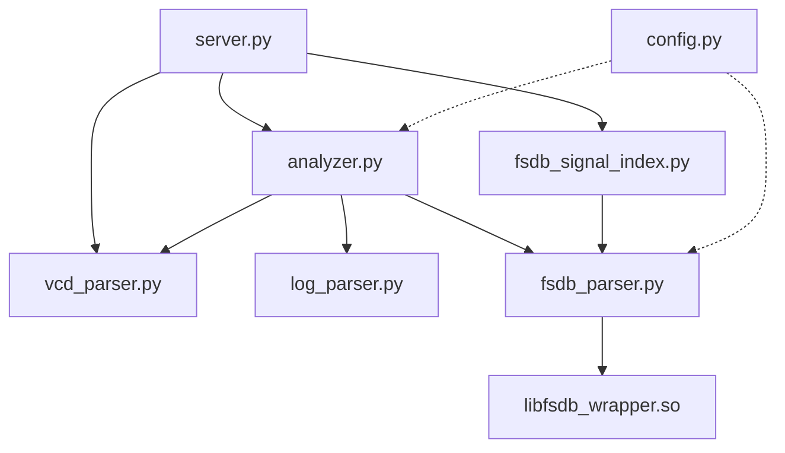

# Waveform MCP 系统架构与调用关系

该文档展示了 `waveform_mcp` 项目中各脚本的功能层级与交互逻辑。

## 1. 系统调用关系图



### 1.1 架构拓扑 (字符版 - 预览异常时请参考)
```text
┌───────────┐      ┌────────────────────────┐      ┌─────────────────┐
│ server.py │ ───> │ fsdb_signal_index.py   │ ───> │ fsdb_parser.py  │
└─────┬─────┘      └────────────────────────┘      └────────┬────────┘
      │                                                     │
      │            ┌────────────────────────┐               │    ┌──────────────────────┐
      └──────────> │      analyzer.py       │ ──────────────┴──> │ libfsdb_wrapper.so   │
                   └──────────┬─────────────┘                    └──────────────────────┘
                              │
               ┌──────────────┴──────────────┐
               ▼                             ▼
       ┌──────────────┐              ┌──────────────┐
       │ log_parser.py│              │ vcd_parser.py│
       └──────────────┘              └──────────────┘
```

---

## 2. 核心文件职责说明 (文字版)

如果您无法显示上述拓扑图，请参考以下层级划分：

### 【第一层：网关】server.py
*   **功能**：所有请求的统一入口。它就像一个翻译官，把 AI 发出的 JSON 指令翻译成 Python 函数。

### 【第二层：大脑】src/analyzer.py
*   **功能**：逻辑串联。当你要“自动分析失败原因”时，它负责先指挥 `log_parser` 找错，再指挥 `fsdb_parser` 找波形，最后把结果揉在一起。

### 【第三层：专家】src/ 子目录模块
*   **log_parser.py**：只负责读文本 Log，用正则提取 UVM 错误。
*   **fsdb_parser.py**：核心动力。负责从 FSDB 里精准抓取某时刻的信号。
*   **fsdb_signal_index.py**：搜索加速。只管找信号在哪，不管信号是多少。
*   **vcd_parser.py**：备选动力。纯 Python 读 VCD。

### 【第四层：底座】根目录配置文件
*   **config.py**：全局变量池。存路径、存参数、存开关。
*   **libfsdb_wrapper.so**：由 `fsdb_wrapper.cpp` 编译而来。它是波形引擎的物理基础。

---

## 3. 典型调用链演示
**情景：搜索信号关键字并获取值**
1.  用户 -> AI: "帮我搜搜 clk"
2.  AI -> `server.py`: 调用 `search_signals`
3.  `server.py` -> `src/fsdb_signal_index.py`: 发起搜索
4.  `fsdb_signal_index.py` -> `src/fsdb_parser.py`: 调用底层接口
5.  `fsdb_parser.py` -> `libfsdb_wrapper.so`: 触发 C++ 解析
6.  `libfsdb_wrapper.so` -> 返回结果给 AI
