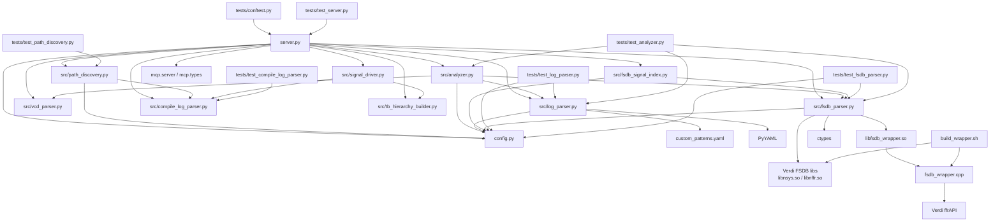

# Architecture

## Dependency Graph



## Layering

```text
MCP interface
  server.py

Core logic
  src/path_discovery.py
  src/compile_log_parser.py
  src/tb_hierarchy_builder.py
  src/analyzer.py
  src/log_parser.py
  src/signal_driver.py

Waveform backends
  src/vcd_parser.py
  src/fsdb_parser.py
  src/fsdb_signal_index.py

Native integration
  libfsdb_wrapper.so
  fsdb_wrapper.cpp
  Verdi ffrAPI/libs or repo-local runtime symlinks

Config and extension
  config.py
  custom_patterns.yaml

Verification
  tests/*
```

## Notes

- `server.py` is the composition root and runtime entry point.
- `src/path_discovery.py` is the path discovery layer for compile logs, sim logs, and waveforms.
- `src/compile_log_parser.py` and `src/tb_hierarchy_builder.py` provide compile-log-based structure extraction.
- `src/analyzer.py` depends on the shared parser interface implemented by `VCDParser` and `FSDBParser`.
- `src/signal_driver.py` is a lightweight source-link layer built on compile-log discovery and source scanning.
- `src/fsdb_parser.py` is the Python/native boundary and resolves FSDB runtime from repo-local links first, then `VERDI_HOME`.
- `fsdb_wrapper.cpp` is the native/tool-vendor boundary.
